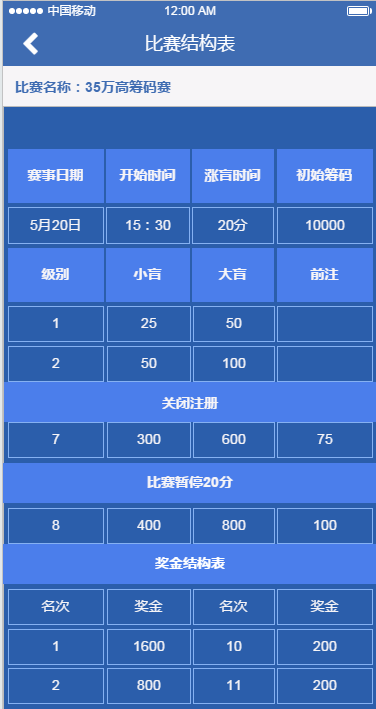

# 赛事宝设计方案
**1 产品简介**

赛事宝是北京竞技之旅科技有限公司开发的一款赛事类app。产品整合了gpi、ept guide
等信息资源，用户可以迅速的查询国内外各类赛事信息，同时，赛事宝提供的购票系统，用户可便捷的购买国内外大型赛事门票。临时想比赛，无处寻？俱乐部功能来帮忙，一键查询俱乐部赛事信息，快速报名，只等你来战。

**2 功能模块**

用户：赛事展示模块、赛事日历（查询）模块、支付模块、用户注册／登陆模块、gps地图模块、门票验证模块、营销模块、积分模块。商城模块、排行榜模块（2.0）

商家：信息录入模块、信息查询模块、门票核销模块、财务模块（竞技之旅往来账务）

**3 TableBar 详解**

demo url:
https://modao.cc/app/a33f8b5de85cb8486f51cd68f1bc872f90ad5c5c
password:123465

分页栏分为推荐、俱乐部、赛事日历、我的（或我的账户）、更多五栏

推荐栏：展示当月各类赛事，国际大赛、国内大赛、俱乐部大赛（不含每日常规比赛）
排序方式默认按照国际、国内、俱乐部； 程序开发时设计为可自定义顺序，便于市场灵活运作。

俱乐部栏：默认显示全国所有俱乐部当日比赛信息
左上角可根据地区选择，右上角可根据俱乐部名称选择。

赛事日历栏：可按月份查询国际、国内大型赛事（俱乐部举办的大赛包含在国内大型赛事内）、系列赛事（赛事类别为国际或国内大赛，区别为此类赛事为玩家最关注或广告赞助多）

我的栏：查询我的相关信息，包括报名凭证、注册信息、积分信息等

更多：为app后期开发预留，目前可查询的栏目为俱乐部介绍及公司信息栏

**3.1 TableBar-推荐栏详细说明**

listview  组件

设计图

image=赛事大图

T1 赛事种类icon   分为国际、国内、俱乐部 ，国际用W，国内用IN，俱乐部用C

T2 赛事种类文字描述   具体为 ：国际 、国内、俱乐部

T3 赛事名称  中英文字符可能含标点符,字长设计保留最大长度12

T4 赛事时间icon    固定icon

T5 赛事时间文字

**点击图片进入赛事介绍**

设计图

Saishi-Image-logo = 赛事的logo图片，统一风格设计

Saishi-Text-Intrudt= 赛事的详情介绍

Saishi-Text-Name= 具体赛事的名称   

赛事详情=固定字段

**点击赛事详情进入赛事详情页面★（重点）**

玩家可查询赛事中具体比赛的信息（通常此类比赛除主赛外还有一系列边赛）
查询赛事结构表、赛事结果；可报名比赛，可按日期查看所有当前系列赛事
★ 某些大型赛事市场部未谈妥代理且需要展示时，“参加赛事”按钮为灰色，即玩家无法报名，运维人员在录入赛事时设定

设计图

Saishi-Image-L= 赛事大图   同推荐页
Calender =赛事日历 可按日期查看该赛事信息，如6月20日-27日 ，超过该时段无法选择，点击设定为灰色
Saishi-Text-Name= 具体赛事的名称  需加上编号#x（x为数字）
Saishi-Text-type=赛事类型 目前暂为 hold'em 德州扑克，后期还有梭哈、奥马哈等，最大字长预留7.
Buy-in = 买入费用  货币类型可能有人民币、美元、韩元等，若能自动计算最好，前期可以自己手动添加，如买入100w韩元，备注1w人民币

Time-Open =比赛开放注册时间
Time-Close=比赛关闭注册时间      
Structure-Table = 比赛结构表 （可点击项）

Sign-up =参加赛事  (大多比赛截至报名时间非比赛开始时间，通常为比赛开始后的第几个盲注级别，及参加赛事的状态为不能报名，无法点击态应根据该比赛的赛事结构表中的停止注册规则设定。实际在使用时，可能俱乐部常规比赛会遇到较多，程序设计时注意停止注册时间，参加赛事状态亦需改变为无法点击)

Result= 比赛结果 （ ★  比赛未开始前显示为灰色，不可点击查询态，比赛结束后，运维人员录入信息，状态为可点击查询，需预留修改接口）

**比赛结构表**

玩家可查询比赛的详细结构及奖金结构。不同的比赛，结构可能不同，开发时可预设一些模版，需要留可编辑录入接口。此表信息为展示用，可不和其他信息想关联。

**参加赛事 页面（报名）**

点击参加赛事跳转到报名页面，此页面在点击购票时判断用户是否登录。

case1： 已登录
购票数量可点击增加

进一步点击（选微信支付）：
跳转到服务端支付

case2：未登陆，显示如下

点马上登陆 跳转到登陆页面

**比赛结果展示**

运维人员在赛事完毕后录入，表暂为4列名次、姓名、奖金、积分，最大设计6列，保留2列。 积分会在排名系统中体现
★ 若针对国内的赛事，可能奖金以其他替代方式出现

**3.2俱乐部分页栏详细说明**

点击TableBar 俱乐部路由到俱乐部分页栏，默认显示全国所有俱乐部当日比赛信息
左上角可根据地区选择，右上角可根据俱乐部名称选择。

设计图

club-image、赛事详情、参加赛事 为可点击类

**club-image 点击效果**

跳转到俱乐部今日赛事详情页面，同左上角直接选择俱乐部跳转页面相同
展示俱乐部当日比赛、明日赛事和昨日俱乐部获奖情况（此表为营运人员次日手动录入），表和2.0排名系统关联。
注意事项：报名截至时间过后，参加赛事按钮将变为不可点击，颜色为灰色

页面有3个可点击项：俱乐部logo、地图、电话
点击地图调用高德地图、电话点击为拨出

**俱乐部logo点击效果**

跳转到俱乐部介绍页面

此页面的图集、地图、电话 为可点击项
地图调用高德地图、电话点击为拨出

**赛事详情点击效果**
同前比赛结构表

**参加赛事点击效果**
同前参加赛事 页面（报名）

**3.3 赛事日历栏详细说明**

用户可在此页面按月份查询国际、国内（含俱乐部大赛）、系列赛事（关注度高的多站赛事）的相关情况。 历史记录保留一年。默认点击显示国际赛事栏及当月月份。
当月赛事场数为系统自动统计显示

  注意,国际赛事的验证方式和俱乐部日常赛事验票方式不同，俱乐部
验票为支付成功后的二维码或序号，国际赛事在点击购票钱程序需要先判断用户信息是否输入完整，包含（真实姓名、昵称、手机、邮箱、身份证照片、护照照片、大头照），若信息不完成，提示弹框请录入完整信息并跳转至录入页面, 此信息查询页面在“我的账户-信息详情”中可查看。

国际赛事展示栏分成2类：
主流赛事及谈妥合作的赛事以大图显示，其他以小图显示。小图的详情相对简单，不提供结构表结果等查询，示例

只提供时间、地点、名称、买入费用列

国内赛事不区分，都为大图显示

**系列赛事栏**

系列赛事点击如下：

**系列赛事概览**

展示某个系列赛事官方提供的信息。 下一站比赛时间，地点等,点击图片进入赛事介绍

**系列赛事详情**

同赛事详情

**3.4 我的账户分页栏详细说明**

展示用户相关信息，包含会员登录、报名凭证、我的信息、优惠券（可在支付时抵扣）、我的订单、我的积分（后期积分换礼品用）、我的排行榜（2.0实现，细分为n种类型，如城市排行，俱乐部排行、男女选手排行等）、积分商城（2.0实现，兑换积分）模块

**会员登陆**

会员登陆说明：左边的icon 初期为固定图标，后期用户可选择，若用户未登陆，显示点击登陆，跳转到登陆页面，反之显示已登陆。

用户注册登陆
点击进入

通过手机号/用户名 +密码+验证码 登陆

**会员注册**

需要手机验证码对接平台
赛事宝服务条款为弹窗，隐私保护、游戏规则：注册真实姓名，否则优惠券及商城兑换不予通过等说明

**忘记密码**

通过注册信息找回

**报名凭证**

报名凭证：用户成功报名后获取的序列号（二维码），点击可查看凭证历史

分为已使用、未使用、已过期三种状态，未使用的点击验证显示序列号（二维码），商家验证后，状态改变；
已使用可查询7天内的验证码

★ 需要设计商家验证系统

**我的信息**

显示用户注册时填写的相关信息，用户可以补充完善自己的信息，完成后不可修改，添加按钮隐藏。

**优惠卷**

 目前优惠卷为微信商户后台发卡，用户的优惠卷在微信账户－卡卷里可查看，如何联动？

**我的订单**

显示用户已报名的订单，可同商家订单数据，含赛事时间、名称、金额

**我的积分**

 用户每支付10人民币，积1分，积分可在积分商城兑换相应礼品。初期积分商城在微信公众号的微店体现，积分兑换功能为运维人员手动兑换。程序设计时需预留积分添改接口

**3.5 更多分页栏说明**

后期版块增加时预留，目前俱乐部介绍

右上为俱乐部城市划分
点击俱乐部详情进入俱乐部介绍，同前俱乐部logo点击效果

**联系我们**

